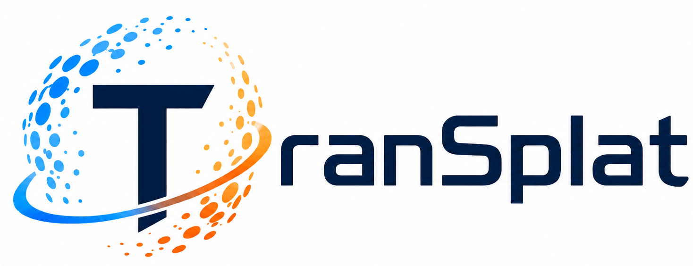
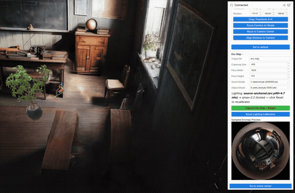
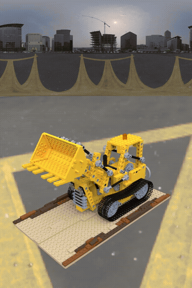
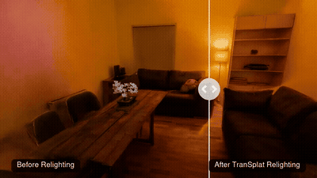
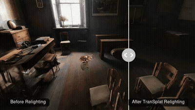
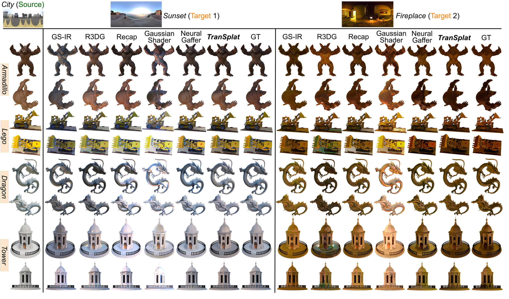

<p align="center">
  
</p>

# TranSplat: Instant Cross-Scene Object Relighting in Gaussian Splatting via Spherical Harmonic Transfer

<p align="center"><b>ICCP 2026</b></p>

[Project Page](https://tonyyu0822.github.io/transplat/) | [Paper](https://arxiv.org/abs/2503.22676) | [arXiv](https://arxiv.org/abs/2503.22676) | [2D Gaussian Splatting (base)](https://github.com/hbb1/2d-gaussian-splatting) <br>

This repo contains the official implementation for **TranSplat**, a method for instant, accurate object relighting within the Gaussian Splatting (GS) framework. Rather than relying on costly inverse-rendering routines, TranSplat is a BRDF-free radiance transfer strategy that analytically modulates the spherical harmonic (SH) appearance coefficients of an object's 2D Gaussian surfels using per-normal irradiance ratios derived from source and target environment maps. A specularity-aware dual-path SH transfer strategy adapts higher-order SH bands in the reflection domain for view-dependent, glossy appearance, and a lightweight SH-domain self-shadowing module produces physically realistic occlusion without explicit mesh raycasting. TranSplat is a post-processing step — it requires no additional GS retraining per source/target scene pair, and it relights in well under one second.

Built on top of [2D Gaussian Splatting](https://github.com/hbb1/2d-gaussian-splatting), which represents a scene as a set of 2D oriented disks (surfels) rasterized with perspective-correct differentiable rasterization. **The core of TranSplat is a single, self-contained file — [`radiance_transfer_TranSplat.py`](radiance_transfer_TranSplat.py)** — everything else in this repo is the (largely unmodified) 2DGS training/rendering pipeline plus a few diagnostic/demo scripts around it.

## ⭐ News
- 2026/07/17: Initial public code release, alongside the [project page](https://tonyyu0822.github.io/transplat/).

## 🚧 GUI (Coming Soon)

We are packaging the interactive GUI shown below — real-time source/target environment-map sampling with live, spatially-varying relighting — for public release. It is **not** part of this repository yet; the preview below is a capture of the internal tool.



## Installation

```bash
# download
git clone --recursive https://github.com/tonyyu0822/TranSplat.git
cd TranSplat

# if you already have a working 2D Gaussian Splatting conda environment,
# just activate that one and skip straight to `pip install` below —
# TranSplat adds no new dependencies on top of 2DGS.
conda env create --file environment.yml
conda activate surfel_splatting
pip install submodules/diff-surfel-rasterization
pip install submodules/simple-knn
```

*Note: This code has been verified to build and run with **CUDA Toolkit 11.8**. If you encounter GCC version errors (e.g. "unsupported GNU version") during the `pip install` step, ensure you are compiling with GCC 11 or earlier by prefixing the install commands with `CC=gcc-11 CXX=g++-11`.*

**Custom data**: TranSplat uses the same COLMAP / NeRF-Synthetic loaders as 3DGS/2DGS. To prepare your own COLMAP scene, see `convert.py` and the [3DGS data prep instructions](https://github.com/graphdeco-inria/gaussian-splatting?tab=readme-ov-file#processing-your-own-scenes).

## Training

To train a scene, simply use
```bash
python train.py -s <path to COLMAP or NeRF Synthetic dataset> -m <output dir>
```
or, via the driver script (see [Running the pipeline](#running-the-pipeline) below):
```bash
scripts/run_transplat.sh train -s <dataset> -m <output dir>
```

Commandline arguments for regularization:
```bash
--lambda_normal              # hyperparameter for normal consistency
--lambda_dist                # hyperparameter for depth distortion
--lambda_alpha               # RGBA mask / opacity supervision for synthetic RGBA data
--depth_ratio                # 0 for mean depth, 1 for median depth (0 works for most cases)
--sh_degree                  # max SH degree (default: 3)
--sh_degree_up_interval      # increase active SH degree by 1 every N iterations (default: 3000)
```
Higher final SH quality on glossy/specular objects (important for relighting) generally benefits from a higher `--sh_degree` paired with a longer `--sh_degree_up_interval`, e.g.:
```bash
python train.py -s <dataset> -m <output dir> \
    --sh_degree 5 --sh_degree_up_interval 3000 \
    --lambda_normal 0.05 --lambda_dist 0.0
```
**Trade-off:** increasing `--sh_degree` improves relight quality — especially specular highlights — since TranSplat's specular transfer operates directly on the higher-order SH bands, but it also increases per-Gaussian storage and rendering cost, lowering FPS. See the paper for a detailed quality/speed analysis.

For RGBA synthetic datasets, the loader preserves the alpha channel as a training mask. The default `--lambda_alpha 0.05` supervises rendered opacity against that mask, which suppresses outside-object floaters and keeps relit renders exportable as RGBA.

The vanilla training defaults follow the relighting-ready setup used for the released examples: active SH degree advances every 3000 iterations, the 2DGS normal-consistency loss ramps from iteration 7000 to 15000, geometry is frozen after iteration 20000, and densification uses a lower gradient threshold to preserve sufficient surfels for relighting. Prior-based DC/albedo decomposition is not used by default.

## Relighting

Relighting is a post-training, post-processing step: it reads a trained point cloud and a pair of HDR environment maps, and writes out a new, relit point cloud — no retraining required.

```bash
python radiance_transfer_TranSplat.py \
    --source <source.hdr> --target <target.hdr> \
    --ply <path to trained point_cloud.ply> \
    --output <path to write the relit .ply>
```
or
```bash
scripts/run_transplat.sh relight --ply <point_cloud.ply> --source-env <source.hdr> --target-env <target.hdr> -o <relit.ply>
```

Useful flags: `--floor_alpha` (diffuse denominator floor), `--tau_max` (diffuse transfer clamp), `--specular_boost` (scale for L≥1 SH rest bands), `--num_samples`/`--shadow_res` (self-shadow bake quality/cost trade-off).

<table>
<tr>
<td align="center" width="50%"></td>
<td align="center" width="50%"></td>
</tr>
<tr>
<td align="center">Relighting across multiple target environment maps</td>
<td align="center">Spatially-varying shadows &amp; relighting under a rotating light</td>
</tr>
<tr>
<td align="center" width="50%"></td>
<td align="center" width="50%"></td>
</tr>
<tr>
<td align="center" colspan="2">Real-world object insertion and relighting</td>
</tr>
</table>

## Rendering / Mesh Extraction

Render a trained (or relit) point cloud and/or extract a mesh:
```bash
# Render the trained checkpoint and extract a bounded mesh
python render.py -m <path to trained model> -s <path to COLMAP dataset>

# Render a specific point cloud instead (e.g. the relit .ply from above)
python render.py -m <path to trained model> -s <path to dataset> --ply <relit.ply> --skip_mesh
```
or
```bash
scripts/run_transplat.sh render -s <dataset> -m <model dir> --ply <relit.ply> --skip-mesh
```

When `--ply` is provided, renders are written under a folder named after that PLY, e.g. `train/relit_fireplace/renders`, so relit renders do not overwrite the trained checkpoint renders. Use `--skip_gt` and `--skip_vis` to export only render PNGs; RGBA-trained models write RGBA PNGs by default.

Meshing arguments (same as upstream 2DGS):
```bash
--depth_ratio     # 0 for mean depth, 1 for median depth
--voxel_size      # voxel size for TSDF fusion
--depth_trunc     # depth truncation
--unbounded       # unbounded mesh extraction (space contraction + adaptive TSDF truncation)
--mesh_res        # resolution for unbounded mesh extraction
```
If unspecified, meshing arguments are estimated automatically from the camera information.

## Running the pipeline

`scripts/run_transplat.sh` is a single entry point for training, relighting, and rendering. Each subcommand prints a stage banner and a clear `OK`/`FAILED` result; `pipeline` chains train → relight → render for one scene and stops immediately — naming the failed stage — if anything goes wrong.

```bash
# One-shot: train, relight against a target envmap, and render the result
scripts/run_transplat.sh pipeline \
    -s <dataset> -m <output dir> \
    --source-env <source.hdr> --target-env <target.hdr>

# Individual stages
scripts/run_transplat.sh train      -s <dataset> -m <output dir>
scripts/run_transplat.sh relight    --ply <point_cloud.ply> --source-env <src.hdr> --target-env <tgt.hdr> -o <relit.ply>
scripts/run_transplat.sh render     -s <dataset> -m <output dir> --ply <relit.ply> --skip-mesh
```
Every subcommand accepts extra flags forwarded verbatim to the underlying Python script after a literal `--`, e.g. `scripts/run_transplat.sh train -s <dataset> -m <out> -- --test_iterations 5000 10000`. Run any subcommand with `-h` for its full option list.

## Diagnostics & Demos

Two additional scripts, also reachable through `run_transplat.sh`:

- **Directional visibility diagnostic** — bakes the self-shadowing visibility function and renders it as an RGB image (R/G/B = visibility from world +X/+Y/+Z), useful for inspecting the shadow bake independently of any relighting pair.
  ```bash
  scripts/run_transplat.sh visibility --dataset <dataset> --model <model dir>
  ```
- **Rotating-envmap demo** — bakes visibility once, then relights and renders fixed camera views while the target environment map rotates around the object, encoding the result as an MP4 (this is what produced the "rotating light" comparison GIF in the [Relighting](#relighting) section above).
  ```bash
  scripts/run_transplat.sh demo --dataset <dataset> --model <model dir> --source-env <src.hdr> --target-env <tgt.hdr>
  ```

## Results



TranSplat outperforms recent inverse-rendering and diffusion-based GS relighting methods across most conditions on synthetic and real-world objects, while completing relighting in under one second. See the [paper](https://arxiv.org/abs/2503.22676) for full quantitative results.

## Acknowledgements
This project is built upon [2D Gaussian Splatting](https://github.com/hbb1/2d-gaussian-splatting) (Huang et al., SIGGRAPH 2024), which itself builds on [3DGS](https://github.com/graphdeco-inria/gaussian-splatting). The TSDF fusion for mesh extraction is based on [Open3D](https://github.com/isl-org/Open3D). We thank the authors of both projects for their work.

## Citation
If you find TranSplat useful for your work, please consider citing:
```bibtex
@misc{yu2025transplatinstantcrosssceneobject,
      title={TranSplat: Instant Cross-Scene Object Relighting in Gaussian Splatting via Spherical Harmonic Transfer},
      author={Boyang Yu and Yanlin Jin and Yun He and Akshat Dave and Ravi Ramamoorthi and Guha Balakrishnan},
      year={2025},
      eprint={2503.22676},
      archivePrefix={arXiv},
      primaryClass={cs.CV},
      url={https://arxiv.org/abs/2503.22676},
}
```
